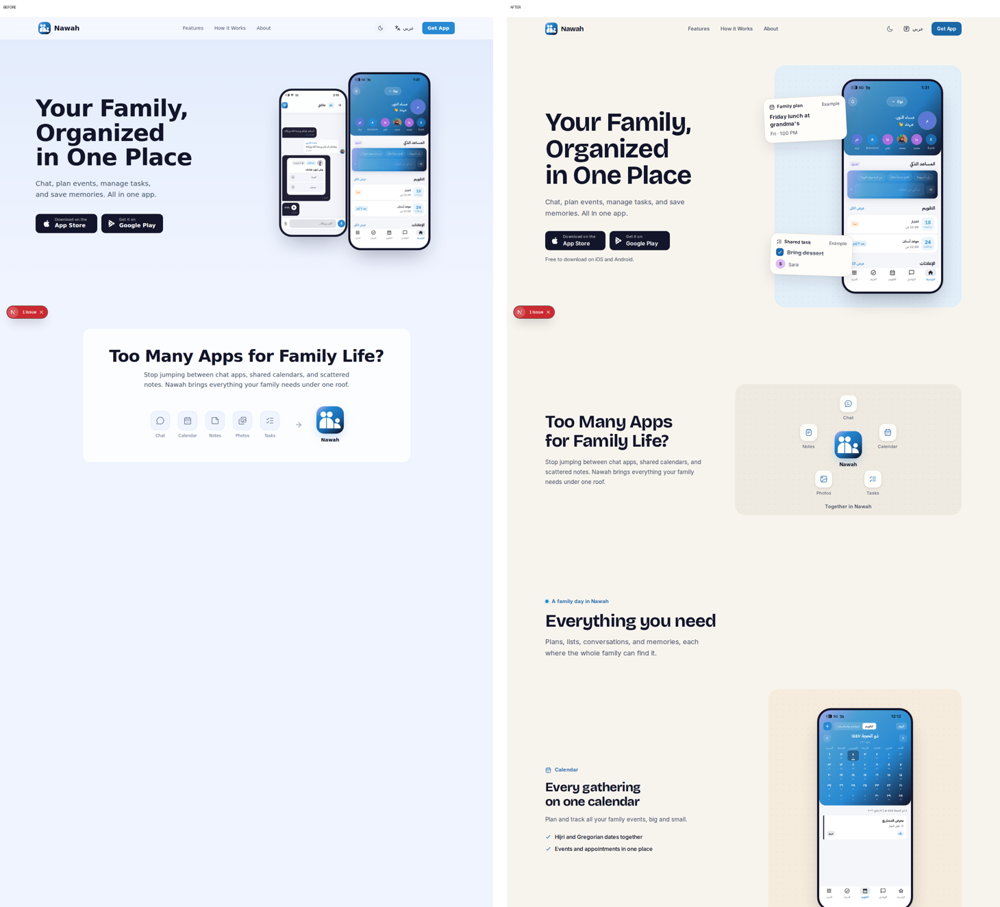
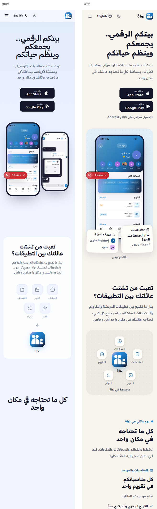
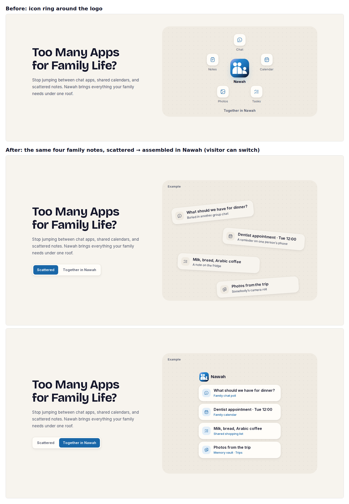
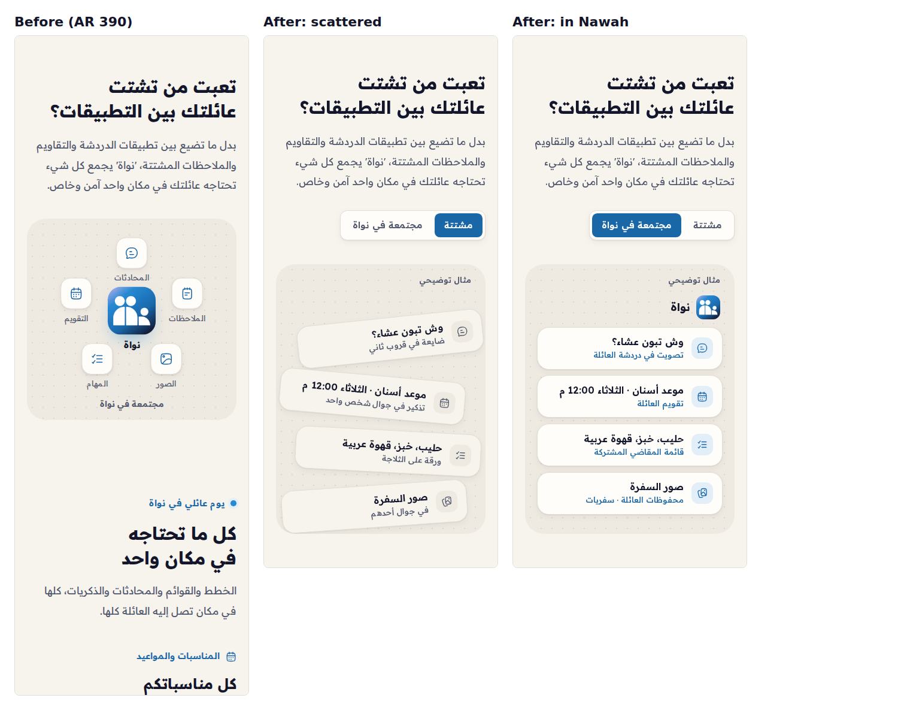
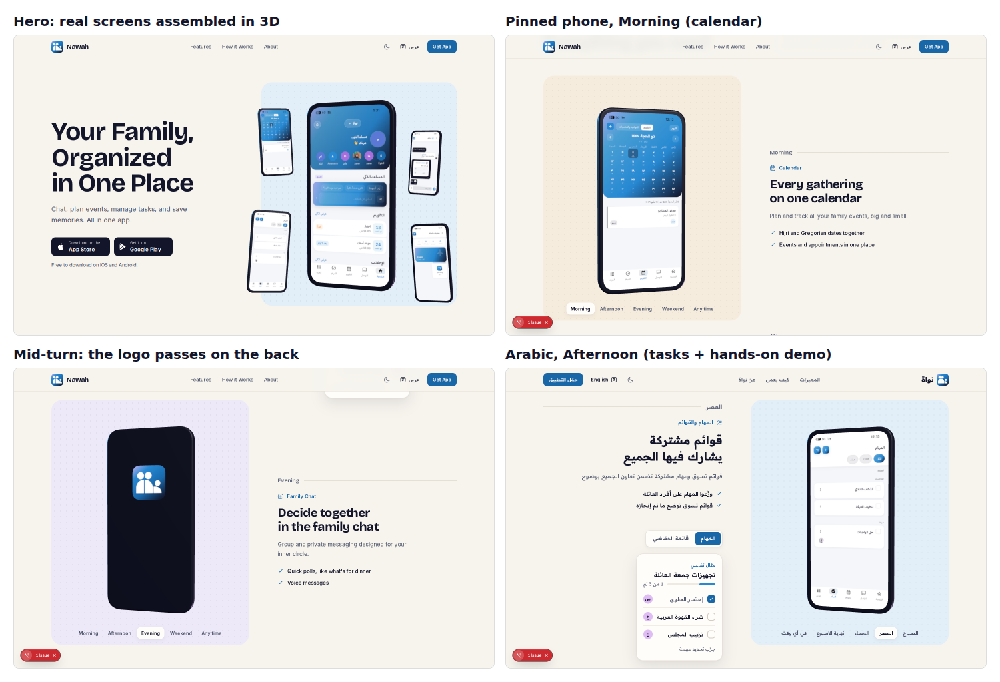

# Landing page redesign — "A family day, brought together" (Oct 2026)

Supersedes the palette/typography in `../MASTER.md` (black + gold, Inter, glass), which never matched the shipped site.

## Audit of the previous page (rendered at 390 / 1440, EN + AR)

Observed:
1. Most of the page (features, how-it-works, final CTA) rendered as large blank areas in a full-page capture: every section started at `opacity: 0` and only appeared through scroll-triggered framer-motion. Any missed trigger leaves content invisible.
2. Every section was the same rounded card on a blue-white wash (`#f0f4ff`), with identical icon + title + text cards for features and steps. Nothing distinguished planning from chat from memories.
3. Screenshots were small and partly cropped (feature cards showed a phone bleeding out of the card corner), so the real app was hard to read.
4. The 5200×5200 `logo.png` (2.26 MB) was loaded raw by the navbar on every page; `favicon.ico` was the same 2.26 MB file.
5. `/og-image.png` and `/apple-touch-icon.png` were referenced in metadata but missing (broken social previews/icons). The Twitter description read "plan founders".

Hypothesis (not measured): the cool blue-on-blue palette and generic SaaS layout undersold the "family" story for an Arabic-first audience.

## Reference ledger

All 13 reference sites were **blocked by this environment's network egress policy** (`EGRESS_BLOCKED`). Web search returned nothing specific for most of them. Only Google Fonts and the npm registry were reachable. No reference was visually inspected, and nothing was copied.

| Resource | Entry URL tried | Access | Principle used | Nawah application | Asset / licence |
|---|---|---|---|---|---|
| ObsidianUI | obsidianui.dev/docs/split-showcase, /r/split-showcase.json | Unavailable (blocked) | Split showcase: copy beside one dominant product image (from the brief's description only) | Hero and feature rows: text column + one large real screen | Registry not run; source unseen |
| Bencho | bencho.dev | Unavailable | Small tactile checklist (brief's description) | `TasksShowcase` checklist demo, original code | None used |
| GetLayers | getlayers.ai/docs | Unavailable | Coherent system over a collage of effects | Single token set, 3 radii, one board motif | None used |
| Landdding | landdding.com | Unavailable | — | Hierarchy based on the brief: CTA above the fold, repeated at the end | None used |
| Motionin "Assembly" | motionin.design/gallery/assembly | Unavailable | Separate items gathering into one composition (brief's description) | Story board: 5 tools gather around the logo, once, on scroll | None used |
| Pageflows | pageflows.com | Unavailable | — | Steps follow Nawah's verified flow: create → invite (link/QR) → organise | None used |
| CollectUI | collectui.com | Unavailable | — | Segmented control and selected states designed in-house | None used |
| Reelfolio Rise/Rolodex | reelfolio.io | Unavailable | Deliberate staging of screenshots (brief's description) | Short cross-fade when switching between Tasks and Shopping list screens; no video | None used |
| Inspora Scenic Footer | inspora.design | Unavailable | A considered ending (brief's description) | Final download board in the app icon's own gradient, with pinned screens | None used |
| Backgrounds.supply | backgrounds.supply | Unavailable | One quiet texture | Original CSS dot grid ("noticeboard") on boards only | None needed |
| Fontshare | fontshare.com, api.fontshare.com | Unavailable | Latin faces (Satoshi, General Sans…) have no Arabic glyphs | Google Fonts instead: **Bricolage Grotesque** (EN headings), **Inter** (EN body), **Readex Pro** (Arabic + Latin) | OFL via Google Fonts |
| Hugeicons | hugeicons.com (blocked); npm registry (reachable) | npm package + README via search | One consistent rounded-stroke family | `@hugeicons/react` + `@hugeicons/core-free-icons` for the landing page, nav and toggles | MIT (free set) |
| remove.bg | remove.bg | Unavailable / not needed | — | Screens are full-bleed rectangles, so no cut-outs needed | — |

Primary guides: split showcase (hero + rows), assembly (story board), tactile checklist (tasks demo), considered ending (download board).

## Directions considered

- **A. Family noticeboard (chosen).** Warm paper canvas, real screens pinned onto dotted boards, small labelled example notes, brand blue + lavender from the icon, plus one warm sand. Warm, readable, works in RTL. Originality comes from composition, not effects.
- **B. Blue album.** Deep navy/blue full-bleed sections. Closer to the old dark CTA, but colder and heavier on mobile, and it fights the blue app screenshots.

## System

- **Colour:** paper `#F7F4EE`, paper-2 `#EFEAE1`, surface `#FFFDF9`, ink `#13152A` (brand navy), muted `#4F566B`, brand `#2789D3` (fills), brand-ink/button `#1A67A8` (text and buttons, ≥ 4.5:1). Supporting: lavender `#DFBCF4` (from the icon), sand `#F0DEC4`. Dark-mode equivalents are in `src/app/globals.css`.
- **Type:** EN display Bricolage Grotesque 700 at 1.02 line-height with negative tracking. AR uses Readex Pro throughout, line-height 1.32 for display and 1.95 for body, with tracking always 0.
- **Radii:** 0.75rem (controls) · 1.25rem (cards/notes) · 2rem (boards) · 2.5rem (device frame).
- **Screens:** real 1170×2532 screenshots in a slim 6px navy frame, never cropped except the deliberate bottom crop in the AI card and final board.
- **Motion:** 160–320ms feedback (checkbox pop, progress bar, screen cross-fade, button press). There is one 700ms "gather" on the story board. All of it is removed under `prefers-reduced-motion`. No content starts hidden.

## Copy changes (flag for review)

Hero, problem, feature names/descriptions, steps and CTA copy are unchanged. Added:
- Feature headlines plus two detail lines each. Every detail was checked against a real screenshot: Hijri + Gregorian calendar, events/appointments tabs, per-member task filters, shopping list progress (1/3), chat poll ("وش تبون عشاء") and voice message, vault folders (سفريات, وصفات طبخ) and counters (photos/videos, PDFs, notes), AI answering "ما المهام المعلقة؟", and the "رتّب أسبوعنا" suggestion.
- Example fragments and the interactive demo use invented sample data (e.g. "Friday lunch at grandma's", Sara/Khalid/Noura). They are always labelled "Example" / "مثال توضيحي".
- "Free to download on iOS and Android" appears under the hero buttons. It reuses the existing CTA claim.
- Fixed the Twitter description typo ("plan founders" → "plan events").

## Checks (5 Oct 2026, local dev + production build)

- Renders at 320 / 390 / 768 / 1440 in EN and AR, light and dark. There is no horizontal overflow at any width and no clipped Arabic.
- Keyboard: logical tab order, visible focus on every control. The screen switcher (`aria-pressed`) and checklist (native checkboxes, `role=status` live text) work by keyboard and touch. The mobile menu closes on link tap and Escape.
- Reduced motion: transitions are 0s and the story board renders already gathered.
- Links: App Store, Google Play, /privacy, /terms, /support, /about, the anchors, and EN/AR switching (`lang`/`dir` update) all return 200.
- Contrast (WCAG): body/muted text 6.1–7.2:1, brand text 5.0–5.4:1, button text 5.9:1, download board 4.97:1 (≈4.2:1 only at the corner glint behind the logo).
- `tsc` is clean and `next build` succeeds. ESLint reports 9 issues, all pre-existing (same lines before the redesign).
- Not done: Lighthouse/field performance and screen-reader runs with VoiceOver/TalkBack.

---

# Second pass (5 Oct 2026, later the same day)

This pass started from the redesign above, which was already merged. This time the reference sites were reachable from this environment, so I inspected them and then revised the parts of the page that were still weakest. I did not rebuild the page from scratch.

## Audit of the redesigned page

I rendered the page locally with Playwright at 1440 (EN) and 390 (AR), viewport by viewport.

Observed:
1. **The "too many apps" story was an abstract diagram.** Five generic icon tiles circled the logo. It showed no family content and no product, which is the "decorative diagram" the brief asks to avoid. At 1440 the copy column also left about 200px of empty space under the text.
2. **The feature section header left half the row empty.** At 1440, "Everything you need" sat on the left and the right ~700px was blank.
3. **The feature rows read as one repeated template.** Calendar, tasks, chat and memories each used eyebrow, headline, body, two ticks, then a pastel board. Nothing tied them together as "a family day", even though the eyebrow promised one.
4. **Vertical rhythm was loose.** The desktop page was 7,518px tall. There was about 250px of empty paper between "How it works" and the download board, and 300px or more between feature rows.
5. **The download board gave desktop visitors nothing to act on.** Store badges are a dead end on a laptop. The repo already holds a QR code for nawahfamily.com (`public/qr.png`), but the page didn't use it.

Not a problem: there was no horizontal overflow at 320 to 1440, Arabic was not clipped, and the existing hero worked well enough to keep.

## Reference ledger (this pass)

"Rendered" means Playwright loaded the page in Chromium. "Text" means only the server HTML or metadata was readable.

| Resource | Exact entry URL | Access | Observed principle | Nawah application | Asset / licence |
|---|---|---|---|---|---|
| ObsidianUI: Split Showcase | obsidianui.dev/docs/split-showcase, registry `/r/split-showcase.json` | Docs rendered; **registry source read** (9.9 KB TSX). The live preview stayed blank in headless Chromium. | Two cards on either side of a dotted divider, with a spring shift on hover. It is built for partner logos, not product screens. | Two-state comparison (scattered vs together) on a dotted board. **Not installed:** it needs `motion` + `clsx` + `tailwind-merge`, and its content model (logos) doesn't fit. | MIT (repo LICENSE). No code copied. |
| ObsidianUI: Art Gallery, Draggable Marquee | /docs/art-gallery, /docs/draggable-marquee | Docs text rendered | Drag-through lensed grid; infinite marquee with drag momentum | Rejected. Both are photo-gallery effects, and Nawah has six phone screens, not a photo set. | — |
| Bencho | bencho.dev | Index rendered. Card previews visible (Asset swap, Todo tower list: "Reply to Nadia / Renew the domain…"). Checklist source is behind sign-up. | Everyday, concrete item text makes a micro-interaction believable | Story notes use concrete family items ("Milk, bread, Arabic coffee") instead of category names | No source used |
| GetLayers | getlayers.ai | Home rendered (template grid, "Copy a prompt" model) | Templates sold as one coherent system | Kept the single token set; added no new colours or effects | Premium. Nothing acquired. |
| Landdding | landdding.com/tag/mobile-app → **/l/todoist-4xmte**, **/l/givingli-aporc** | Entry metadata rendered; entry screenshots failed to load, so I rendered the linked live sites (todoist.com, givingli.com) | Todoist: the hero shows real tasks ("Dentist appointment", "Buy bread"). Givingli: warm off-white canvas, physical objects tilted around a large editorial headline. | Story notes are everyday items, tilted when scattered, on the warm paper canvas | Inspiration only |
| Motionin: Assembly | motionin.design/gallery/assembly | Page text + meta description. The preview canvas rendered blank headless. | "A swarm of cards … assembles into one composed cluster" | The story notes drift in from where they live today and assemble into one Nawah stack, once, on scroll. The visitor can switch views. | Prompt not copied |
| Pageflows | pageflows.com | **Blocked** (Cloudflare challenge / 403) | — | "Getting started" stays on Nawah's verified flow: create → invite (the link/QR join routes exist in `src/app/join`) → organise | — |
| CollectUI | collectui.com, /challenges/checkbox | Rendered, but entries load client-side and only ads and directory content appeared | — | No change. The segmented control's pressed state is reused for the new toggle. | — |
| Reelfolio | reelfolio.io | Home text read (Rise/Rolodex are editor templates); renders timed out headless | Staging static shots as a sequence | Already covered by the 240ms screen swap; no video added | Paid export; not used |
| Inspora: Scenic Footer | inspora.design/posts/scenic-footer-section | **Blocked** (Vercel security checkpoint) | — | The download board stays; I added a practical desktop QR hand-off instead of decoration | — |
| Backgrounds.supply | backgrounds.supply | Home rendered; /freebies 404 | — | No texture added. The existing CSS dot grid stays the one background treatment. | Not needed |
| Fontshare | api.fontshare.com/v2/fonts | **API read**: 100 families, none list Arabic | Latin-only catalogue | Confirms the Readex Pro (Arabic) + Bricolage/Inter (Latin) pairing; no change | ITF FFL; not used |
| Hugeicons | hugeicons.com, /docs | Rendered (React quick-start docs) | One stroke family | New story icons come from the same `@hugeicons/core-free-icons` set already installed | MIT (free set) |
| remove.bg | remove.bg | Rendered | — | Not used. Screens are full rectangles; no cut-outs needed. | — |

**Primary references for this pass:** Motionin Assembly (separate items gathering into one composition), ObsidianUI Split Showcase (two states, dotted divider), the Todoist landing page via Landdding (concrete everyday items), and Givingli via Landdding (warm canvas, tilted physical objects).

## Directions considered

- **A. Assemble the family's day (chosen).** Swap the icon ring for four believable family notes that move from where they live today into one Nawah stack, and give the feature rows a morning → weekend spine. It is concrete, verifiable against the screenshots, and reuses the existing motion and tokens.
- **B. Replace the story with a large real-screen gallery** (marquee or carousel). This was rejected. The hero, features and CTA already show every real screen, so a gallery would repeat them, and marquees are hard to make accessible.

## What changed

- **Story section** (`ProblemSection.tsx`, `landing.css`):
  - Four example notes: dinner question, dentist appointment, shopping items, trip photos. Each maps to a verified screen: the chat poll "وش تبون عشاء", the "موعد أسنان 12:00" event, the shopping list, and the سفريات vault folder.
  - When scattered, each note is labelled with where it lives today ("A note on the fridge"). When assembled, it is labelled with its Nawah home ("Shared shopping list").
  - The board plays the assembly once on scroll. A segmented toggle (`aria-pressed`) lets visitors switch views by mouse, keyboard or touch. A visitor's choice is never overridden.
  - With reduced motion, the board renders already assembled with no transitions. Offsets mirror in RTL.
- **Features:** each row now starts with a time-of-day rule (Morning / Afternoon / Evening / Weekend / Any time) running toward its screen. The header is two columns on desktop.
- **Download board:** a QR hand-off ("On a computer? Scan…") appears only at ≥56rem with a fine pointer, so never on phones.
- **Rhythm:** section padding is 6.5rem max (was 7.5), feature gap is 6rem max (was 8), and the gap before the download board is tightened. The desktop page went from 7,518px to 7,314px EN, while the story board grew.

## Copy changes (flag for review)

- New example copy in the story notes, labelled "Example" / "مثال توضيحي". The Gulf phrasing ("وش تبون عشاء؟", "قروب") matches the existing chat-poll detail line.
- New time-of-day labels (EN/AR). These are framing, not product claims.
- The QR caption says it opens Nawah's page (it encodes `https://nawahfamily.com`). It does not claim to open the store.
- Removed the now-unused `Problem.chat/calendar/notes/photos/tasks` keys.
- No headline, description, feature or claim copy was changed.

## Checks (production build served locally)

- Rendered EN/AR at 320, 390, 768 and 1440, plus dark mode (via the site's stored theme): `scrollWidth` equals the viewport width at every size, and no Arabic is clipped. Both story states were checked at 320, 390 and 1440.
- Keyboard: the story toggle works with Enter and Space, has a visible 3px focus ring, and updates `aria-pressed`. Touch: tapping it works on iPhone 13 emulation (AR), and so does the checklist demo.
- Reduced motion: the board never enters the scattered state, and transitions compute to `0s`.
- Contrast: time labels are 4.9:1 (light) and 6.5:1 (dark). Note labels are 5.8:1 / 9.0:1. Scattered labels are 6.7:1.
- Links: `/`, `/ar`, `/privacy`, `/terms`, `/support`, `/about` and `/qr.png` return 200 (`/en` 307 → `/` is the existing locale routing). App Store and Google Play URLs return 200.
- `tsc --noEmit` is clean and `next build` succeeds. ESLint shows the same 9 pre-existing findings as the base commit, none in the files changed here.
- The only console error is PostHog's missing key in local env (pre-existing).
- Not done: screen-reader passes (VoiceOver/TalkBack) and Lighthouse/field performance. No new dependencies; the only new image is the existing 7.6 KB QR.

## Rubric (subjective review, not user testing)

| Dimension | Score | Observation |
|---|---|---|
| Brand fit | 4 | Warm paper, the icon's blue and navy, and Gulf-Arabic sample copy about family life. |
| Originality | 4 | The assembling family notes and the morning-to-weekend spine are specific to Nawah. The hero is still a conventional split, kept on purpose because it works. |
| Clarity | 4 | The story now shows *what* gets scattered and *where it lands* in the app, instead of naming categories. |
| Craft | 4 | One radius scale, one icon set, and one segmented control reused. Calendar and chat rows still share a template, softened by the time spine. |
| Mobile & RTL | 4 | Mobile gets a smaller sideways drift so notes stay on the board; offsets mirror in RTL. At 320 the tilted notes wrap to 2–3 lines but stay readable. |
| Accessibility & performance | 4 | Native buttons with `aria-pressed`, nothing starts hidden, the reduced-motion path is tested, and there are no new dependencies. Screen readers untested. |

---

# Third pass: 3D (5 Oct 2026, evening)

The owner asked for something bigger, using three.js. Both 3D pieces are built from the **real app screenshots**. No abstract shapes or AI decoration were added.

## What it is

- **Hero:** a modelled Nawah phone (extruded rounded body, bevelled edges, navy finish, brand-blue rim light) shows the real home screen. Four more real screens (calendar, chat, tasks, memory vault) fly in from scattered positions and dock around it. This is Motionin's "Assembly" idea, now in 3D. Afterwards they drift with the pointer and spread out as the hero scrolls away. On narrow stages the screens move behind the phone and peek out at its sides, so the main screen stays readable. Everything mirrors in RTL.
- **"A family day" (desktop ≥64rem):**
  - One phone stays pinned (sticky) while five chapters scroll past: Morning (calendar), Afternoon (tasks), Evening (chat), Weekend (memory vault), Any time (AI).
  - At each new chapter the phone turns a full circle. The Nawah logo passes on its back, and it comes round on the next real screen. Turns accumulate, so fast scrolling doesn't snap.
  - The board tint follows the time of day. A time rail (buttons, `aria-current="step"`) jumps between chapters.
  - The Tasks/Shopping-list switch also turns the phone, and the hands-on checklist demo sits beside the copy.
- **Phones and tablets (<64rem):** each chapter keeps its own 2D screen, as before. The hero still gets the 3D scene.
- The memories band and the separate AI card were folded into the chapters.

## Fallbacks and performance

- `three` and `@react-three/fiber` load through `next/dynamic` with `ssr: false`. The real screenshot renders first and stays as the poster; the canvas cross-fades in only once its textures are uploaded.
- 3D is skipped entirely, and the three.js chunk is never requested, when any of these is true: `prefers-reduced-motion`, Data Saver, or no WebGL. In that case the pinned stage cross-fades real screenshots in 2D.
- The chunk is ~238 KB gzipped and is fetched after the page's `load` event. It is not in the initial HTML.
- Textures go through the Next image optimizer at ~768px (WebP/AVIF), not the 0.2–1.5 MB source PNGs.
- Each render loop pauses (`frameloop="never"`) while its canvas is away from the viewport. DPR is capped at 1.75.
- No drei: the phone geometry, screen UVs and motion are about 150 lines of our own code.

## Other fixes made on the way

- `html`, `body` and `<main>` used `overflow-x: hidden`, which turns them into scroll containers and silently breaks `position: sticky`. The fix is `overflow-x: clip` on `html` and `<main>`, and none on `body`. Sideways overflow is still clipped (`scrollWidth` equals the viewport at 320–1440).
- Removed the now-unused hero fragment copy (`Hero.planLabel` etc.).

## Checks (production build)

- 320, 390, 768, 1024 and 1440 in EN and AR: no horizontal overflow, and both scenes reach the "ready" state. Dark mode renders the phone legibly (rim light on navy).
- Desktop: the active chapter, rail state, board tint and phone screen stay in sync. The Shopping-list switch turns the phone to the real list screen. Rail buttons work by keyboard (Enter) and scroll the chapter to the centre.
- Reduced motion: 0 canvases, and the 2D stage swaps to the right screen. Phones: 1 canvas (hero), and the pinned stage is `display: none`.
- The earlier checks still pass: story toggle (keyboard/touch/reduced motion), checklist demo, QR hidden on touch, all routes 200.
- `tsc` is clean and `next build` succeeds. ESLint shows the same 9 pre-existing findings, none in new code.
- Not measured: frame rate on real low-end phones, Lighthouse, and screen readers. The 3D was checked with SwiftShader (software WebGL) in headless Chromium, not on a GPU.

## Round two of the 3D pass

- **Download board: a browsable ring of every real screen** (Home, Calendar, Tasks, Shopping list, Family chat, Memory vault, AI assistant). This follows the brief's Reelfolio "Rolodex" lead.
  - Drag or flick to turn it; it snaps to the nearest screen and keeps the flick's momentum. Prev/next buttons and a caption ("Calendar · 2 of 7") show which screen is in front.
  - Screens dim as they turn away, and the back of the ring folds out of the way. RTL reverses the direction.
  - It advances every 3.2s until the first interaction, then stays where the visitor left it. It also pauses on hover, on focus, and off-screen.
  - The caption is `aria-live="polite"` only after an interaction, so autoplay is never announced. `touch-action: pan-y` keeps vertical scrolling working on phones.
  - Fallback (reduced motion, Data Saver, no WebGL): the two pinned screens stay, with no controls.
- **Hero is now interactive:** tapping a floating screen spins it into the main phone and sends the main phone's screen out to that card. It is pointer-only and nothing depends on it, so its hint ("Tap a screen to bring it forward") is `aria-hidden`.
- **Glass glint on every phone:** a soft light streak slides across the screen as the phone turns.
- The three.js chunk is still ~239 KB gzipped and lazy. Phones run 2 canvases (hero, download ring); desktop runs 3. Only the canvases near the viewport render.
- Checks: everything listed above for the 3D pass still passes. New results: tap-to-swap, autoplay → stop on interaction, keyboard prev/next, drag with momentum, and the reduced-motion fallback (no controls, posters visible). No overflow at 320–1440 in EN/AR. Not tested: touch-drag on a real phone (only mouse drag was automated).
